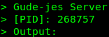
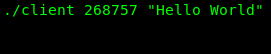
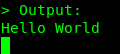

<div align="center">
    <h1>MINITALK</h1>
</div>
<div align="center">
	<h1>Description</h1>
	<p>The objective of this project is to write a small data exchange program using UNIX signals</p>
	<h1><a href="subject.pdf">Subject</a><h2>
</div>

<div align="center">
	<h1><a href="https://dot99.github.io/42-minitalk/index.html">Documentation</a></h1>
</div>

<div align="center">
	<h1>How to run</h1>
</div>

### Step 1 / Clone Repo

```bash
$ git clone https://github.com/Dot99/42-minitalk.git
```

### Step 2 / Compile the program

```bash
$ make
```

### Step 3 / Run server

```bash
$ ./server
```


### Step 4 / Run client

The server will print a PID which we have to use on client
```bash
$ ./client <server_pid> "TEXT"
```


### Step 5 / Result
After this we will get the following result on the server:
<br>


## Disclaimer:
This project's source code adheres to the standards of 42 School and its norms and rigorous coding practices:
```
- We refrain from using 'for,' 'do while,' 'switch,' 'case,' or 'goto' constructs.
- Each function has no more than 25 lines of code. 
- There's a maximum of 5 functions per file.
- Assignments and declarations are kept on separate lines unless the variable is declared as static.
- We ensure that no single function has more than 5 variables, promoting code simplicity and readability.
```